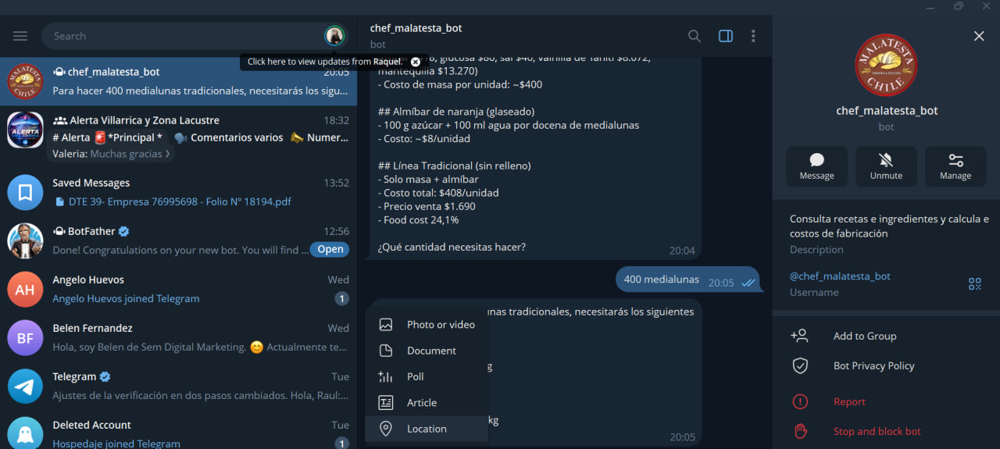

# Agente Interno Malatesta — Challenge Allura

Agente de IA para la administración interna de la Panadería Artesanal Malatesta
(Villarrica, Chile). No es un chatbot de atención al cliente: lo usan el dueño
o el panadero para consultar recetas e instrucciones de preparación, calcular
el costo de fabricación al escalar un pedido a una cantidad específica (ej. un
evento con 50 medialunas), actualizar precios de insumos, y llevar el registro
diario de producción/costo.

## Arquitectura

```
challenge Allura/
├── data/
│   ├── recetas.md               # recetario en texto: ingredientes e instrucciones reales
│   ├── recetas_ingredientes.csv # cantidad de cada insumo por producto/variante (receta estructurada)
│   ├── precios_insumos.csv      # precio vigente de cada materia prima
│   ├── catalogo_precios.csv     # categoria y precio de venta por producto/variante
│   └── produccion_diaria.csv    # log de producción diaria (se alimenta solo)
├── src/
│   ├── tools.py         # cálculo determinístico: costeo en vivo desde insumos, escalado, food cost, inventario
│   ├── ingest.py        # indexa recetas.md en un vector store (FAISS) para búsqueda semántica
│   ├── agent.py         # agente LangChain (Cohere) que combina el retriever + las tools
│   ├── chat.py          # CLI de prueba local
│   └── telegram_bot.py  # bot de Telegram -- interfaz principal, desplegada en Railway
├── deploy/
│   └── railway_setup.md # pasos de deploy
└── requirements.txt
```

**Por qué este diseño:** el LLM (Cohere) nunca calcula números de memoria.
Todo el costo se calcula EN VIVO a partir de `recetas_ingredientes.csv x
precios_insumos.csv` en `tools.py` — si se actualiza el precio de un insumo
(por chat o editando el CSV), todos los productos que lo usan quedan
recosteados automáticamente. El LLM solo decide qué herramienta llamar y
redacta la respuesta en español. Esto evita que el agente "invente" cifras de
costos, algo crítico cuando el resultado se usa para negociar precios con
clientes.

Las búsquedas de producto/variante toleran texto libre, errores de tipeo y
frases mal separadas (ej. "masa quebrada sablee" completo en un solo campo) —
si no hay coincidencia exacta, se ofrecen alternativas por similitud en vez de
fallar.

- **Documento (parte 1 del challenge):** `data/recetas.md`, con 5 categorías
  reales (Facturas, Medialunas, Sándwiches, Masas Quebradas, Galletas) —
  ingredientes, cantidades e instrucciones de preparación, no solo datos
  sueltos.
- **Agente (parte 2):** LangChain + Cohere (`command-a-03-2025`), con 9
  herramientas: búsqueda de receta/costeo, escalado de costo, escalado de
  ingredientes reales (gramos/kg/L), listar variantes por categoría, listar y
  actualizar precios de insumos, búsqueda semántica en el recetario, registro
  de producción diaria, y cálculo de costo diario.
- **Deploy (parte 3):** bot de Telegram (long-polling) corriendo en Railway.
  No requiere abrir puertos ni exponer IP pública -- el proceso solo hace
  conexiones salientes a la API de Telegram. Ver `deploy/railway_setup.md`.

## Ejemplos de preguntas y respuestas

| Pregunta | Qué hace el agente |
|---|---|
| "¿Cuánto me cuesta hacer 50 medialunas de pistacho para un evento?" | Llama a `escalar_receta(Medialuna, Pistacho, 50)` → costo total real, precio actual e ingreso, food cost. |
| "Un cliente quiere 200 facturas surtidas, ¿a qué precio se las vendo para tener 25% de food cost?" | Llama a `escalar_receta` con `food_cost_objetivo=25` → precio de venta sugerido. |
| "Dame una receta de masa quebrada" | Como es genérico, usa `listar_variantes` (opciones numeradas) y pregunta cuál quiere antes de mostrar el detalle. |
| "¿Cómo se hace la masa sablée?" | Busca en el recetario (`buscar_en_recetario`) y devuelve ingredientes + procedimiento reales, y pregunta la cantidad para escalarlo. |
| "Necesito hacer 5 masas sablée" | Llama a `escalar_ingredientes` → lista de insumos y cantidades reales (g/kg/L) para esa cantidad. |
| "La harina subió a $1.100 el kilo" | Llama a `actualizar_precio_insumo` → recostea automáticamente todos los productos que usan harina. |
| "Hoy hicimos 40 facturas de manjar" | Llama a `registrar_produccion`, guarda el consumo derivado en `produccion_diaria.csv`. |
| "¿Cuál fue el costo de producción de hoy?" | Llama a `costo_diario` y suma todo lo registrado ese día. |

## Cómo correrlo localmente

1. Crear entorno e instalar dependencias:
   ```powershell
   python -m venv .venv
   .venv\Scripts\activate
   pip install -r requirements.txt
   ```
2. Conseguir una API key gratuita en [Cohere](https://dashboard.cohere.com/api-keys)
   y un token de bot de Telegram hablando con [@BotFather](https://t.me/BotFather)
   (comando `/newbot`). Copiar ambos a un archivo `.env` (basado en `.env.example`):
   ```
   COHERE_API_KEY=tu_key_aqui
   TELEGRAM_BOT_TOKEN=tu_token_aqui
   ```
3. Construir el índice de búsqueda del recetario:
   ```powershell
   python -m src.ingest
   ```
4. Probar por consola (sin Telegram, más rápido para depurar):
   ```powershell
   python -m src.chat
   ```
5. O correr el bot de Telegram localmente:
   ```powershell
   python -m src.telegram_bot
   ```
   y escribirle al bot desde la app de Telegram.

## Deploy

Desplegado en **Railway** (bot de Telegram, long-polling). Ver
[`deploy/railway_setup.md`](deploy/railway_setup.md) para el paso a paso.

Bot en producción: **@chef_malatesta_bot** (t.me/chef_malatesta_bot).

### Evidencia — conversación real en producción



```
Tú: dame una receta de masa quebrada... (interacción previa: bot mostró
    receta de Medialuna Tradicional -- masa, almíbar, costo $408/u,
    precio $1.690, food cost 24,1% -- y preguntó la cantidad)

Bot: ¿Qué cantidad necesitas hacer?

Tú: 400 medialunas

Bot: Para hacer 400 medialunas tradicionales, necesitarás los siguientes
     ingredientes:
     - Harina 0000: 27.04 kg
     - Leche en polvo: 1.80 kg
     - Azúcar: 5.69 kg
     - Glucosa: 225.36 g
     - Sal: 450.72 g
     - Vainilla de Tahití: 2.33 kg
     - Mantequilla: 7.48 kg
```

Cifras verificadas contra `recetas_ingredientes.csv` (masa + almíbar por
unidad × 400) — coinciden exactas.

